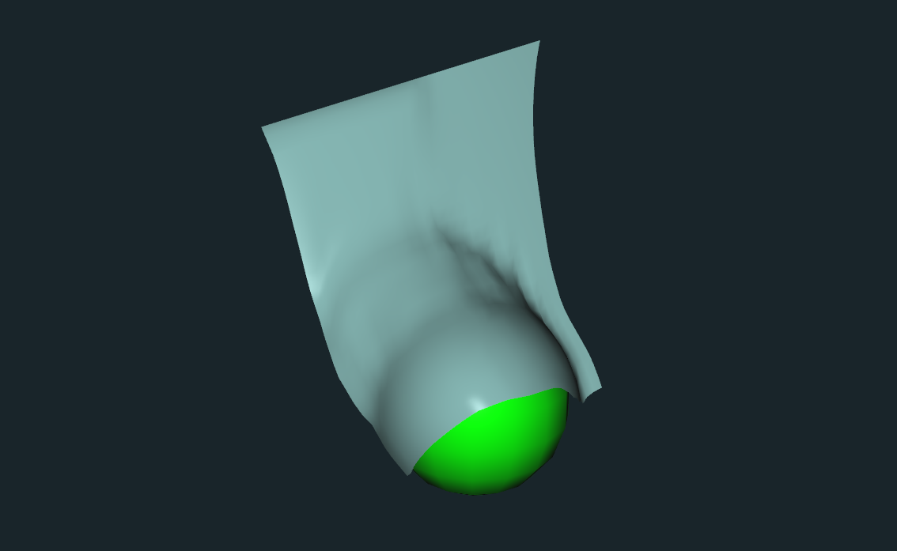

# Cloth Simulation in Fabric Engine

My first attempt at doing cool stuff in Fabric, had a lot planned for this but ended up having to settle for a basic cloth simulation.

Only tested in Fabric Engine 2.1.0.

### Future Improvements
* Proper constraint setup based on topology
* Better integration technique
* Make use of the manipulator tools to paint on fixed vertices and such

Watch the demo video here : https://vimeo.com/166024346

## Installation

* Append the ClothSimulation-FabricEngine/FabricCloth/Ext path to FABRIC_EXTS_PATH
* Ensure the Fabric environment.sh script is actually reading in this path
* The ClothSimulation presets should be visible in the presets browser and the ClothSimulation extension should be loadable.
* See an example scene in FabricCloth/Samples

## Special Thanks

[Marc Albrecht](https://github.com/Marc-Albrecht) for answering all my silly questions and all the helpful people at the [Fabric Forums](http://forums.fabricengine.com) for doing the same.
